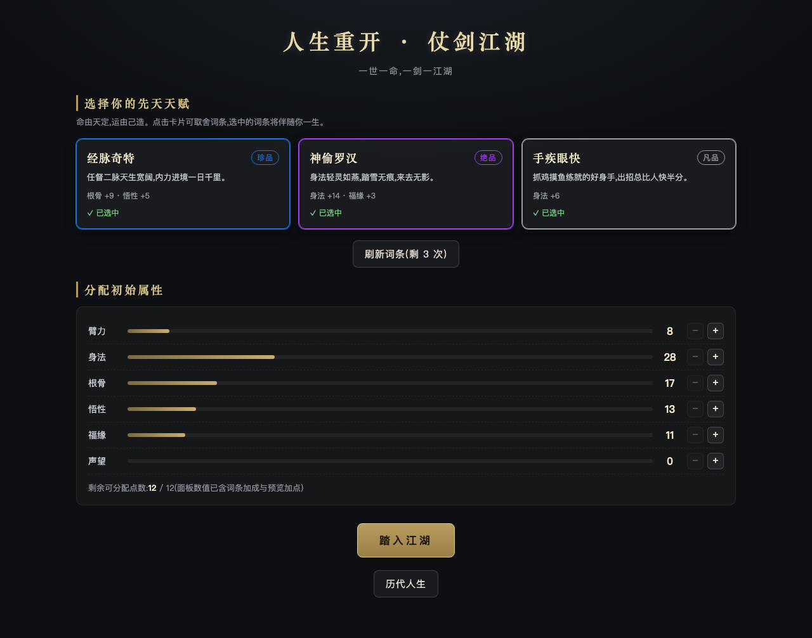
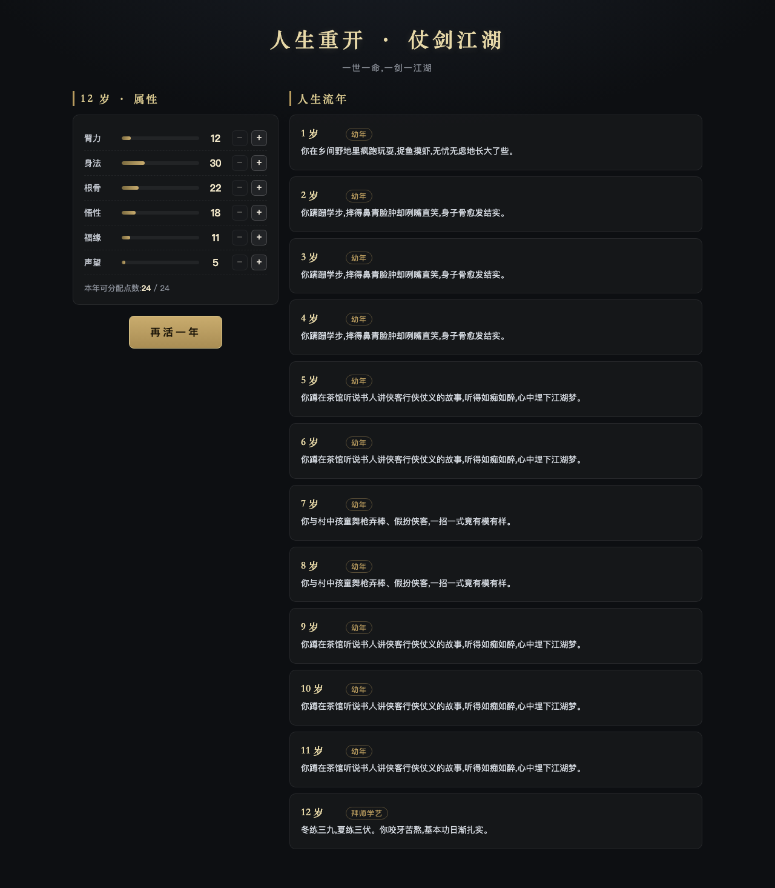
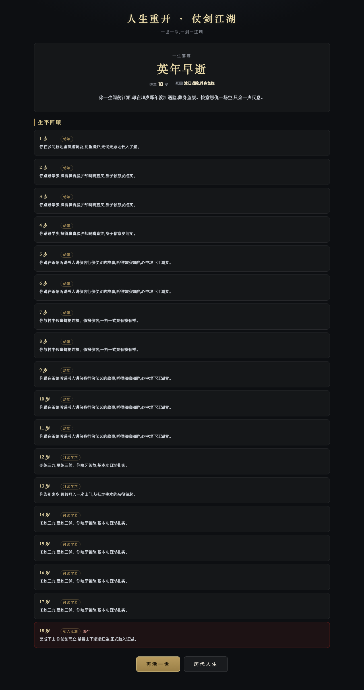

# Game · 小游戏 Monorepo

一个承载多款小游戏 / demo 的 monorepo。React 前端 + Node(Fastify)后端 + SQLite 数据库,本地即可跑通最小闭环。共享的游戏逻辑放在 `packages/game-core`,前后端复用同一份。

> **当前默认:本地单机模式。** 前端在浏览器内直接运行 `game-core` 引擎,历代人生存 `localStorage`,**无需启动后端**。`pnpm --filter @game/life-restart dev` 一条命令即可游玩。后端 `apps/api` 代码完整保留,可随时切回联网模式(见下文「本地 vs 联网」)。

## 技术栈
- **Monorepo**: pnpm workspaces + Turborepo
- **前端**: React 18 + Vite + TypeScript(开发端口 5173,被占用则自动顺延)
- **共享逻辑**: `@game/game-core`(词条 / 属性 / 剧本事件 / 武功 / 推进引擎,纯函数、带单测)
- **后端(保留,可选)**: Node + Fastify(端口 3001)
- **数据库(保留,可选)**: SQLite(better-sqlite3,`apps/api/data/life.db`)

## 目录结构
```
game/
  apps/
    portal/         # 游戏合集导航页(部署到 Pages 根)
    life-restart/   # 《人生重开模拟器》React 前端
    wulin-mud/      # 《武林群侠传》文字 MUD React 前端
    api/            # (可选,保留)Fastify 服务 + SQLite
  packages/
    game-core/      # 武侠核心逻辑: 词条/六维属性/武功/剧本事件/推进引擎
    mud-core/       # MUD 逻辑: 世界地图/回合战斗/探索/物品/彩蛋(复用 game-core)
    tsconfig/       # 共享 TS 配置
```

## 游戏
| 游戏 | 类型 | 本地启动 |
|---|---|---|
| **江湖集**(合集页) | 导航 | `pnpm --filter @game/portal dev` → :5175 |
| **人生重开模拟器** | 文字模拟 | `pnpm --filter @game/life-restart dev` → :5173 |
| **武林群侠传** | 文字 MUD | `pnpm --filter @game/wulin-mud dev` → :5174 |

**联动彩蛋**:玩过《人生重开》后,《武林群侠传》开局会读取你的前世结局(localStorage),化作今生的属性加持。

## 快速开始(本地单机模式,推荐)
```bash
pnpm install                          # 安装依赖
pnpm --filter @game/life-restart dev  # 只起前端,打开 http://localhost:5173 即玩
```
无需后端、无需数据库,词条/推进/结局全在浏览器内计算,历代人生存 `localStorage`。

### 本地 vs 联网(后端保留)
- **本地单机(默认)**: 前端直连 `src/local-engine.ts`,在浏览器跑 `game-core`。
- **联网模式(可选)**: 后端 `apps/api`(Fastify + SQLite)完整保留。切回方式:把 `apps/life-restart/src/api.ts` 顶部的 re-export 换成文件底部注释里的 HTTP 实现,再 `pnpm dev`(同时起 api + web)。详见该文件注释。

> **想让别人也能玩?** 见 [DEPLOY.md](DEPLOY.md)。单机模式下前端是纯静态产物,`pnpm --filter @game/life-restart build` 的 `dist/` 可直接丢 GitHub Pages / Vercel(此时历代人生存在每个访客自己的浏览器里)。

## 常用命令
```bash
pnpm dev          # turbo 并行起所有 app 的 dev
pnpm build        # turbo 构建所有
pnpm test         # turbo 跑所有测试(目前 game-core 单测)
pnpm typecheck    # turbo 全量类型检查

# 单独操作某个包
pnpm --filter @game/game-core test
pnpm --filter @game/api dev
pnpm --filter @game/life-restart build
```

## 游戏一:《人生重开模拟器 · 仗剑江湖》
开局刷词条(分凡/良/珍/绝/传说五档稀有度,可消耗次数刷新)→ 分配初始属性 → 一年一年推进武侠人生(剧本「少年仗剑江湖路」:幼年→拜师→初入江湖→恩怨沉浮→门派风云→宗师归隐)→ 每年可加点 → 寿终或横死触发结局结算(称号+评价+死因)→ 整局入库,可查看历代人生。

### 画面
| 开局刷词条 | 推进中的时间线 | 结局结算 |
|---|---|---|
|  |  |  |

### 六维属性
臂力 / 身法 / 根骨 / 悟性 / 福缘 / 声望。根骨在开局定下寿元基数;福缘降低横祸概率;声望与战力决定结局高度。

### API 一览(统一响应 `{code, message, data}`)
| 方法 | 路径 | 说明 |
|---|---|---|
| GET | `/api/meta` | 属性名 / 稀有度配色 / 常量 |
| GET | `/api/traits/roll` | 抽 3 条词条(带剩余刷新次数) |
| POST | `/api/life/start` | 开局:`{traitIds, name?, initialAlloc?}` → `lifeId` |
| POST | `/api/life/advance` | 推进一年:`{lifeId, alloc?}` → 当年事件+结局(若落幕) |
| GET | `/api/lives` | 历代人生列表 |
| GET | `/api/lives/:id` | 单局逐年明细 |

### 数据库
- `lives`:每局汇总(id / name / final_age / ending / evaluation / cause / traits / attrs / created_at)
- `life_years`:逐年流水(life_id / age / stage / event_text / attr_snapshot)
- `sessions`:进行中对局的权威状态(flags 序列化为 JSON 数组,崩溃可恢复)

词条不落库,以 `game-core/src/traits.ts` 代码常量维护,便于平衡与扩展。

## 如何加下一款游戏
1. 在 `apps/` 下新建前端(如 `apps/<new-game>`,Vite React)+ 如需后端则复用 `apps/api` 或新建 `apps/<new-api>`。
2. 可复用的纯逻辑放 `packages/game-core`(或新建 `packages/<logic>`),保持前后端单一事实源。
3. `pnpm-workspace.yaml` 已含 `apps/*` 与 `packages/*`,无需改动;turbo 会自动纳入。
4. `pnpm install` 后用 `pnpm --filter <pkg> dev` 起新游戏。

## 设计说明
- 剧本事件为**内置脚本**(非 LLM 生成),离线可跑、结果可复现;词条 flag 会触发专属剧情分支与结局。
- 结局高度由声望/战力/特殊 flag 决定,横死会优先判「英年早逝」。
- `game-core` 引擎支持注入种子随机(`{seed}`),便于测试复现。
